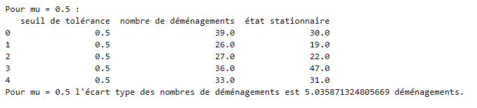

# **Modeling spatial segregation using the Schelling model**

----------- Vous trouverez la version française dans `README_fr.md` -----------

ENSAE ParisTech Spring 2022

Simon GENET • Marie-Olive THAURY

This project is part of the 1A python project. It is supervised by Xavier Dupré.

## Schelling's model : 

Within the framework of our computer project, we have chosen to model segregation (social, ethnic, etc.) using Schelling's model (1971). 

In his article "Dynamic Model of Segregation", Thomas Schelling develops for the first time his theory of unintended segregation from the analysis of the sharing of space between "races" in the United States. Starting from the hypothesis that residents have a "preference" to live with people of the same race, Thomas Schelling shows that even with a slight preference, a neighborhood can become segregated even though this was not the initial intention of the residents. From then on, this segregation would almost be spontaneous.

The model starts with the generation of a non-segregated neighborhood (originally, Thomas Schelling uses a chessboard and copper pieces). The inhabitants have a level of preference to have neighbors of different races (example: *out of 6 neighbors, I would like at least 3 to have the same race as me*). If the inhabitants are not satisfied then they move to a vacant home. After several iterations, we obtain a segregated neighborhood.

## Implementation of the model : 

### 1) Create the city

The goal of this part is to randomly generate a city with its vacant dwellings, its occupied dwellings (=households) and their group (social, ethnic, religious...).

The city is generated from the following parameters:
- the number of households
- the minimum number of vacant dwellings
- the proportion of each group.

We first try to define the optimal dimensions of the city according to the total number of dwellings, then we randomly distribute the vacant dwellings and the households of the different groups in the city.

   

### 2) Simulate the segregation phenomenon

The aim of this part is to simulate the phenomenon of social segregation by simulating household mobilities, following a household's dissatisfaction with the different groups in its neighborhood. 

We simulate the segregation phenomenon described by Schelling using the following parameters
- the matrix of the initial city
- the tolerance threshold $\mu$. The higher the threshold, the more tolerant the inhabitants are of their neighbors' groups. For example, if $\mu = 0.6$ then households do not accept to have more than 60% of neighbors from a different group. 
- the number of years over which the simulation runs. 

Each week, a household is randomly drawn. This household evaluates whether it is satisfied or not with its current housing. Its satisfaction depends on the number of neighbors ${D}_{i}$ who do not belong to the same group as it. 

If the ratio $\frac{D_i}{D_i + S_i}$ (where $S_i$ is the number of neighbors who belong to the same group as him) does not exceed the tolerance threshold $\mu$, the household is satisfied, he decides to stay in his current housing. 

If the ratio $\frac{D_i}{D_i + S_i}$ strictly exceeds the tolerance threshold $\mu$, the household is not satisfied. A vacant dwelling is then randomly drawn and the household performs the same evaluation as before for the vacant dwelling. If the household will be satisfied in the vacant unit, it moves to that unit. If not, they stay in their current dwelling. Thus, unlike the original Schelling model, dissatisfied households only move if they find a satisfactory vacant unit. 

At the end of the year, the number of moves is counted. 

This experiment is repeated over several years and it is observed how the city segregates. 

The aim of this part is to simulate the phenomenon of social segregation by simulating household mobilities, following a household's dissatisfaction with the different groups in its neighborhood. 

   

   

We have succeeded in segregating a mixed city. Indeed, we notice the formation of colored patches that show the grouping of households. Vacant dwellings are represented by the color white. They are found in particular at the "borders" of the segregated areas, as was expected. Indeed, the individuals at the border will exchange with the vacant dwellings located in the center of the zones.

### 3) Influence of the tolerance parameter on the segregation phenomenon

The aim of this part is to observe how the tolerance parameter influences the segregation phenomenon and in particular to find for which thresholds the segregation is the strongest.

The higher the number of moves, the stronger the segregation. Indeed, once a person moves, he is satisfied with his new neighborhood, so he will not try to move again (unless of course his neighborhood changes completely). 

To determine the influence of the tolerance parameter on the level of social segregation, we therefore look for the total number of moves that took place before reaching the stationary state, as a function of $\mu$.

We must first determine the stationary state, then study the stability of our model to know if it is sufficient to do our statistics on a single city or if we should do our statistics on an "average" of several cities. Finally, we will determine the number of years over which we will run the simulation.

#### Finding the steady state

We have made a function that returns the steady state. This steady state is the last year where there was a move. This state remains an approximation because in some cases, there may still be possible moves that are not made due to the randomness of our model. Nevertheless, when the simulation is run over a fairly large number of years, it is a good indicator of when the city has been almost completely segregated. 

#### Stability of the model

We then test the stability of our model for different tolerance thresholds $\mu$, on 5 cities. This will allow us to know if it is enough to make our statistics on a single city or if we should make our statistics on an "average" of several cities. 

   

   

   

   

For each tolerance level $\mu$ , we note that the standard deviation of the number of moves is not too high relative to the number of possible moves. We therefore conclude that the model is relatively stable. 

We observe that the standard deviation of the number of moves is larger for values of $\mu \in [0.6, 0.7]$, which can be explained by the fact that there are more moves and thus a greater dependence on the randomness of our model. 

To be sure of the validity of our values, we will therefore average over 10$ cities to avoid extreme situations. 

#### Number of years of the simulation

Here we are looking for the number of years over which to run the simulation. 

According to the tables presented above and after several repetitions, we noticed that the stationary state can sometimes be reached after the ${900}^{th}$ year. It would therefore be necessary to simulate the phenomenon of social segregation for at least 1000 years to be sure to take into account all the moves. 

However, we can see from the graphs below (number of moves as a function of the year for several $\mu$) that the first 100 years are already indicative of a high level of segregation or not. Indeed, the number of moves per year tends to decrease over the years in a relatively uniform manner for each $\mu$. Thus, if for a  $\mu_0$, segregation is stronger in the first 100 years than for a  $\mu_1$, it will also be stronger in the last 900 years. It is therefore sufficient to focus only on the first 100 years of the simulation, which also allows us to drastically reduce the execution time of our code. 

   

   

   

#### Result

So we decide to plot as a function of $\mu$, the total number of moves that took place during the first 100 years of the simulation.
We estimate for each $\mu$, the total number of moves by an average over $10$ cities of their total number of moves. 

   

We clearly observe that for $\mu \in [0.63, 0.74]$ the number of moves reaches a *peak*, i.e. segregation is strongest for these values.

Below 0.63, the tolerance threshold is too low, so households are rarely satisfied with their future housing: they rarely move and so segregation operates little. 

Similarly, above 0.74, the tolerance threshold is too high, so households are often satisfied with their current dwelling: they rarely seek to move and, likewise, segregation operates little. 