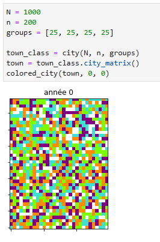
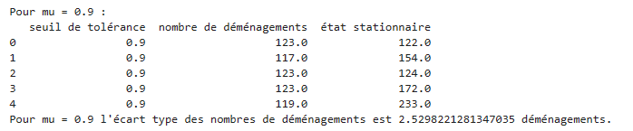
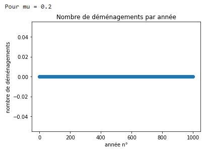

# **Modéliser la ségrégation spatiale à l'aide du modèle de Schelling**

----------- Please find the English version in README_en.md -----------

ENSAE ParisTech 2022-2023

Simon GENET • Marie-Olive THAURY

Ce projet est réalisé dans le cadre du projet python de 1A. Il est supervisé par Xavier Dupré.

## Présentation du modèle de Schelling : 

Dans le cadre de notre projet informatique, nous avons choisi de réaliser une modélisation de la ségrégation (sociale, ethnique ...) à partir du modèle de Schelling (1971). 

Dans son article « Dynamic Model of Segregation », Thomas Schelling développe pour la première fois sa théorie de la ségrégation non voulue à partir de l’analyse du partage de l’espace entre « races » aux Etats-Unis. En partant de l’hypothèse que les habitants ont une « préférence » à vivre avec des personnes de même race, Thomas Schelling montre que même avec une légère préférence, un quartier peut devenir ségrégué bien que ce ne soit pas l’intention initiale des habitants. Dès lors, il y aurait presque un caractère spontané à cette ségrégation.

Le modèle commence par la génération d’un quartier non-ségrégué (à l’origine, Thomas Schelling utilise un échiquier et des pièces de cuivre). Les habitants ont un niveau de préférence à avoir des voisins de races différentes (exemple : *sur  6 voisins, je voudrais que  3 aient au moins la même race que moi*). Si les habitants ne sont pas satisfaits alors ils déménagent dans un logement vacant. Après plusieurs itérations, on obtient un quartier ségrégué.

## Implémentation du modèle : 

### 1) Créer la ville

Le but de cette partie est de générer aléatoirement une ville avec ses logements vacants, ses logements occupés (=les ménages) et leur groupe (social, ethnique, religieux...).

On génère la ville à partir des paramètres suivants:
- le nombre de ménages
- le nombre minimal de logements vacants
- la proportion de chaque groupe.

Nous cherchons tout d'abord à définir les dimensions optimales de la ville en fonction du nombre total de logements, puis nous répartissons aléatoirement les logements vacants et les ménages des différents groupes dans la ville.

   

### 2) Simuler le phénomène de ségrégation

Le but de cette partie est de simuler le phénomène de ségrégation sociale en simulant les mobilités des ménages, suite à une insatisfaction d'un ménage quant aux différents groupes de son voisinage. 

On simule le phénomène de ségrégation décrit par Schelling à partir des paramètres suivants:
- la matrice de la ville initiale
- le seuil de tolérance $\mu$. Plus $\mu$ est élevé, plus tolérants sont les habitants quant aux groupes de leurs voisins. Par exemple, si $\mu = 0.6$ alors les ménages n'acceptent pas d'avoir plus de $60\%$ de voisins d'un groupe différent. 
- le nombre d'années sur laquelle se déroule la simulation. 

Chaque semaine, on tire aléatoirement un ménage. Ce ménage évalue s'il est satisfait ou non de son logement actuel. Sa satisfaction dépend du nombre de voisins ${D}_{i}$ qui n'appartiennent pas au même groupe que lui. 

Si le ratio $\frac{{D}_{i}}{{D}_{i} + {S}_{i}}$ (où ${S}_{i}$ est le nombre de voisins qui appartiennent au même groupe que lui) ne dépasse pas le seuil de tolérance $\mu$, le ménage est satisfait, il décide de rester dans son logement actuel. 

Si le ratio $\frac{{D}_{i}}{{D}_{i} + {S}_{i}}$ dépasse strictement le seuil de tolérance $\mu$, le ménage n'est pas satisfait. On tire alors aléatoirement un logement vacant et le ménage réeffectue la même évaluation que précédemment pour le logement vacant. Si le ménage sera satisfait dans le logement vacant, il déménage dans ce logement là. Sinon, il reste dans son logement actuel. Ainsi, à la différence du modèle de Schelling initial, les ménages insatisfaits ne déménagent que s'ils trouvent un logement vacant satisfaisant. 

A la fin de l'année, on compte le nombre de déménagements. 

On réitère cette expérience sur plusieurs années et on observe comment la ville se ségrègue. 

   

   

Nous avons réussi à partir d'une ville mélangée à la ségréguer. En effet, nous remarquons la formation de tâches de couleur ce qui montre le regroupement par groupe des ménages. Les logements vacants sont représentés par la couleur blanche. On en trouve notamment aux «frontières» des zones ségréguées comme cela était attendu. En effet, les individus à la frontière vont échanger avec les logements vacants situés au centre des zones.

### 3) Influence du paramètre de tolérance sur le phénomène de ségrégation

Le but de cette partie est d'observer comment le paramètre de tolérence influe sur le phénomène de ségrégation et notamment trouver pour quels seuils, la ségrégation est la plus forte.

Plus le nombre de déménagements est élevé, plus la ségrégation est forte. En effet, une fois qu'une personne déménage, elle est satisfaite de son nouveau voisinage, donc elle ne cherchera plus à déménager (à moins évidemment que son voisinage change complètement). 

Pour déterminer l'influence du paramètre de tolérance sur le niveau de ségrégation sociale, on cherche donc en fonction de $\mu$, le nombre total de déménagements qui ont eu lieu avant d'atteindre l'état stationnaire.

Il nous faut d'abord déterminer l'état stationnaire, puis étudier la stabilité de notre modèle pour savoir s'il suffit de faire nos statistiques sur une seule ville ou s'il faut faire nos statistiques sur une «moyenne» de plusieurs villes. Enfin, nous déterminerons le nombre d'années sur lesquelles on fera la simulation.

#### Trouver l'état stationnaire

Nous avons réalisé une fonction qui renvoie l'état stationnaire. Cet état stationnaire désigne la dernière année où il y a eu un déménagement. Cet état reste une approximation car dans certain cas, il peut y avoir des déménagements encore possibles mais qui ne se font pas en raison du caractère aléatoire de notre modèle. Néanmoins, lorsque que l'on fait tourner la simulation sur un nombre assez conséquent d'années, il en est un bon indicateur donnant la date à laquelle la ville a été quasiment totalement ségréguée. 

#### Stabilité du modèle

Nous testons ensuite la stabilité de notre modèle pour différents seuils de tolérance $\mu$, sur $5$ villes. Cela nous permettra de savoir s'il suffit de faire nos statistiques sur une seule ville ou s'il faut faire nos statistiques sur une «moyenne» de plusieurs villes. 

   

   

   

   

Pour chaque seuil de tolérance $\mu$ , nous remarquons que l'écart type du nombre de déménagements n'est pas trop élevé relativement au nombre de déménagements possibles. Nous en concluons donc que le modèle est relativement stable. 

Nous observons que l'écart-type du nombre de déménagements est plus grand pour les valeurs de $\mu \in \left\{0.6, 0.7\right\}$, ce qui s'explique par le fait qu'il y a plus de déménagements et donc une plus grande dépendance au caractère aléatoire de notre modèle. 

Pour être certains de la validité de nos valeurs, nous allons donc réaliser la moyenne sur $10$ villes pour éviter des situtations extrêmes. 

#### Nombres d'années de la simulation

Nous cherchons ici le nombre d'années sur lesquelles il faut réaliser la simulation. 

D'après les tableaux présentés ci-dessus et après plusieurs répétitions, nous avons remarqué que l'état stationnaire peut  parfois être atteint après la  ${900}^{ieme}$ année. Il faudrait donc simuler pendant au moins pendant $1000$ ans le phénomène de ségrégation sociale pour être sûr de prendre en compte tous les déménagements. 

Or, on observe sur les graphiques ci-dessous (nombre de déménagements en fonction de l'année pour plusieurs $\mu$) que les $100$ premières années sont déjà révélatrices d'un niveau élevé ou non de ségrégation. En effet, le nombre de déménagements par année tend à décroitre au fil des années de manière relativement uniforme pour chaque $\mu$. Ainsi, si pour un ${\mu}_{0}$, la ségrégation est plus forte lors des $100$ premières années que pour un ${\mu}_{1}$, elle le sera aussi pour les $900$ dernières années. Il est donc suffisant de ne s'intéresser qu'aux $100$ premières années de la simulation ce qui nous permet par ailleurs de réduire drastiquement le temps d'exécution de notre code. 

   

   

   

#### Résultat :

On décide donc de tracer en fonction de $\mu$, le nombre total de déménagements qui ont eu lieu durant les $100$ premières années de la simulation.
On estime pour chaque $\mu$, le nombre total de déménagements par une moyenne sur $10$ villes de leur nombre total de déménagements. 

   

On observe clairement que pour $\mu \in [0.63, 0.74]$ le nombre de déménagements atteint un *pic* c'est-à-dire que la ségrégation est la plus forte pour ces valeurs.

En deça de $0.63$, le seuil de tolérance est trop bas, donc les ménages sont rarement satisfaits de leur logement futur : ils ne déménagent que rarement et donc la ségrégation opère peu. 

De manière similaire, au-delà de $0.74$, le seuil de tolérance est trop élevé donc les ménages sont souvent satisfaits de leur logement actuel : ils cherchent peu à déménager et, idem, la ségrégation opère peu. 